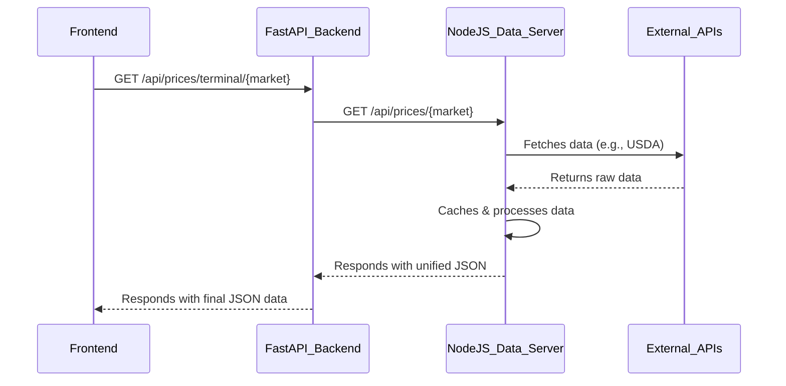

# Foodberg Backend Architecture

This document outlines the architecture and communication flow of the Foodberg backend services.

## Core Components

The backend consists of three primary services that work in concert:

1.  **Vite Frontend (`/frontend`)**: The user interface, built in React and TypeScript.
2.  **FastAPI Application (`/backend`)**: A Python-based service that serves as the primary API gateway for the frontend. It handles business logic, user-facing API requests, and WebSocket connections.
3.  **Node.js Data Server (`/Technical/server`)**: A specialized Node.js/Express server that acts as a middleware and aggregator for all external food commodity data sources. It fetches, caches, and normalizes data, providing a unified API for the FastAPI backend to consume.

## Communication Protocol

The services communicate over local HTTP requests. This microservice-like architecture decouples the primary application logic from the complexities of external data sourcing.

### Workflow Example: Fetching USDA Market Data

1.  **Frontend Request**: The Vite frontend sends a request to the FastAPI backend (e.g., `GET /api/prices/terminal/new_york`).
2.  **Internal API Call**: The FastAPI backend receives the request and makes its own HTTP request to the Node.js data server, which runs on `localhost:3001` (e.g., `GET http://localhost:3001/api/prices/new_york`).
3.  **External Data Retrieval**: The Node.js server calls the appropriate client (e.g., `usda-market-news-client.js`) which fetches data from the external USDA API.
4.  **Caching & Response**: The Node.js server caches the result and sends the processed JSON data back to the FastAPI backend.
5.  **Final Response**: FastAPI performs any final processing or data shaping required and sends the data back to the frontend as the response to its original request.

### Advantages of this Approach

*   **Separation of Concerns**: The FastAPI backend focuses on core application logic, while the Node.js server specializes in the nuances of external data aggregation.
*   **Polyglot Architecture**: Leverages the strengths of both Python (for a robust, type-safe API with FastAPI) and Node.js (for its strong asynchronous I/O performance in handling many external API calls).
*   **Scalability**: The data aggregation service can be scaled independently of the main application backend if necessary.
*   **Maintainability**: Changes to external data sources only require updates to the Node.js server, with no impact on the FastAPI application as long as the internal API contract is maintained.

### Data Format

All communication between the services via `